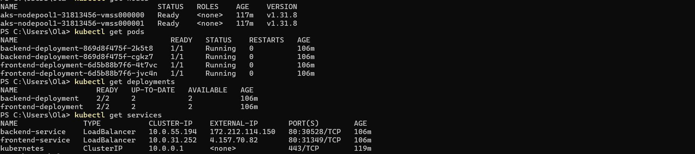
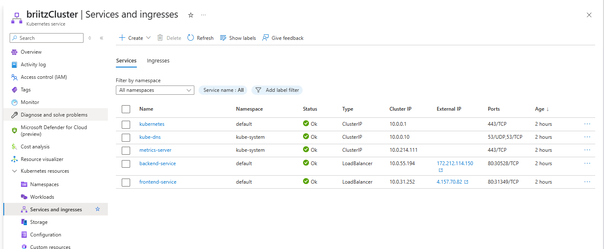

# CI/CD Deployment of a Node.js App on Azure Kubernetes Service (AKS)

This project shows a full journey of deploying an Node.js application (backend and frontend) on azure kubernetes service (AKS) with CI/CD automation using GitHub Actions. 

## Steps

## 🧱 1. Setting up Azure Infrastructure

We begin by setting up the resource group, Azure Container Registry (ACR), and AKS cluster:

```bash
# Create a Resource Group
az group create --name my-resource-roup --location eastus

# Create Azure Container Registry
az acr create --resource-group my-resource-group --name my-acr --sku Basic

# Login to ACR
az acr login --name my-acr

# Create AKS Cluster
az aks create --resource-group my-resource-group --name my-cluster --node-count 2 --node-vm-size Standard_A2_v2 --enable-addons monitoring --generate-ssh-keys --attach-acr my-acr

# Connect kubectl to AKS
az aks get-credentials --resource-group my-resource-group --name briitzcluster

# Confirm node status
kubectl get nodes

```

## 🔁 2. Automating with GitHub Actions (CI/CD)

Check the Github repository for the full build-up of the CI/CD automation for both backend and frontend



